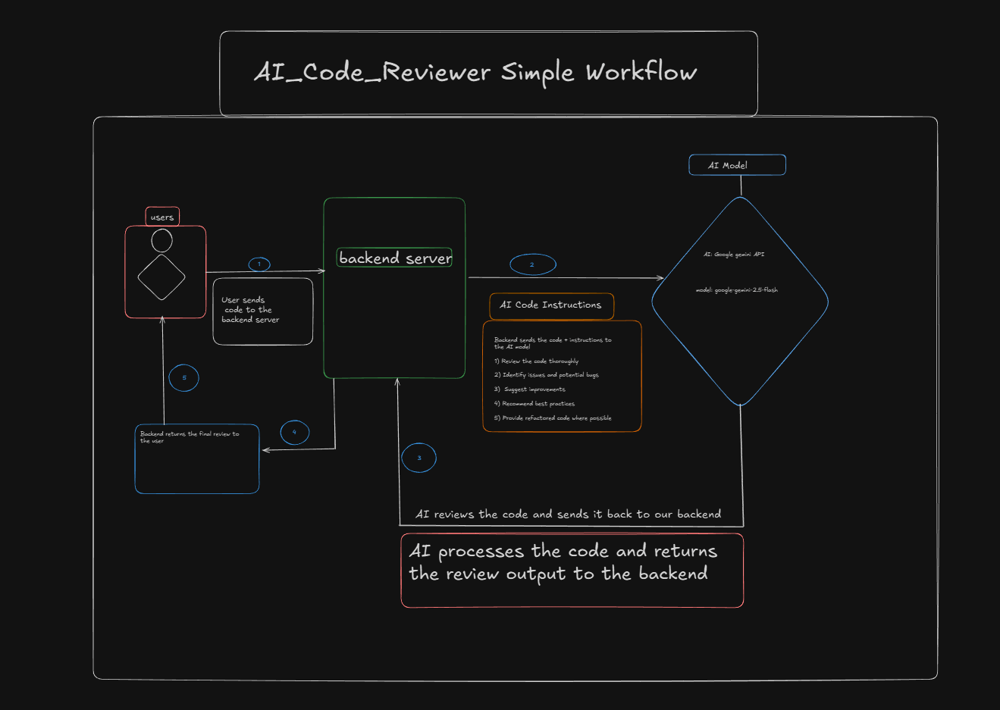

<h1 align="center">🤖 AI Code Reviewer</h1>

<p align="center">
  <i>Enterprise-grade AI code review system powered by Google Gemini</i>
</p>

<p align="center">
  <a href="https://react.dev/"></a>
  <a href="https://vitejs.dev/"></a>
  <a href="https://nodejs.org/"></a>
  <a href="https://expressjs.com/"></a>
  <a href="https://www.mongodb.com/"></a>
  <a href="https://ai.google.dev/"></a>
  <a href="https://render.com/"></a>
  <a href="LICENSE"></a>
</p>

---

## 📸 Screenshots

<p align="center"><i>Visual proof of real functionality — authentic and production-ready</i></p>

### 🎨 Application Interface

<div align="center">
  <table>
    <tr>
      <td width="50%"></td>
      <td width="50%"></td>
    </tr>
    <tr>
      <td align="center"><b>Code Input Interface</b><br/>Clean, intuitive code editor with file upload support</td>
      <td align="center"><b>AI-Generated Review</b><br/>Comprehensive feedback with categorized insights</td>
    </tr>
  </table>
</div>

---

### 🧠 Performance Monitoring Journey

<p align="center"><i>Baseline vs After Feature Integration — Real metrics from Chrome DevTools & Lighthouse</i></p>

<div align="center">
  <table>
    <tr>
      <th colspan="2">Baseline Metrics</th>
      <th colspan="2">Metrics After MongoDB + File Upload</th>
    </tr>
    <tr>
      <td></td>
      <td></td>
      <td></td>
      <td></td>
    </tr>
    <tr>
      <td colspan="2">
        <b>Initial Scores:</b><br/>
        • Lighthouse: 92-95/100<br/>
        • FCP: 0.4-0.9s<br/>
        • LCP: 0.4-0.9s<br/>
        • Speed Index: 2.2-2.7s
      </td>
      <td colspan="2">
        <b>After Feature Integration:</b><br/>
        • Lighthouse: 88-100/100 ⚡<br/>
        • FCP: 0.6-0.9s<br/>
        • LCP: 0.7-0.9s<br/>
        • Speed Index: 0.6-10.6s
      </td>
    </tr>
  </table>
</div>

<p align="center"><i>✅ Metrics verified across multiple Chrome DevTools audits for consistency</i></p>

---

## 🗂️ Database Schema

<p align="center"><i>MongoDB collections structure for storing review data</i></p>

<div align="center">
  
</div>

<p align="center">
  <b>Entity Relationship Diagram</b><br/>
  Shows the structure of <code>REVIEWS</code> and <code>METADATA</code> collections
</p>

**Key Entities:**
- **REVIEWS Collection**: Stores code review data including language, file names, code snippets, and AI-generated feedback  
- **METADATA Collection**: Tracks document metadata like indexer type, collection name, and average document size  

---

## 🖼️ Project Overview

AI Code Reviewer is a full-stack web application leveraging **Google Gemini** to perform automated code reviews with multi-file upload support.

- 🌐 Live: https://ai-code-reviewer-frontend-273n.onrender.com  
- 🔗 GitHub: https://github.com/swarnabha-dutta/AI_Code_Reviewer  

---

## 🚀 Tech Stack
| Layer | Technology | Description |
|:--|:--|:--|
| **Frontend** |  <br>  | Modern UI, blazing-fast dev/build, SPA experience |
| **Backend** |  <br>  | REST API, business logic, CORS, routing, file handling |
| **Database** |  | NoSQL database for storing review history |
| **AI Service** |  | Advanced code review via generative AI |
| **Hosting** |  | Cloud deployment for both frontend and backend |


---

## 🏗 Architecture & Flow

<div align="center">
  
  <p><i>High-level architecture flow of the AI Code Reviewer system</i></p>
</div>


| Part | Location | Key Files / Folders | Description |
|:--|:--|:--|:--|
| **Frontend** | `/frontend` | `src/App.jsx`, `src/main.jsx` | React SPA for code input and displaying AI feedback |
| **Backend** | `/backend` | `server.js`, `src/app.js` | Express server, routing, middleware setup |
| **Routes** | `/backend/src/routes/ai.route.js` | — | Defines `/ai/get-review` POST endpoint |
| **Controller** | `/backend/src/controllers/ai.controller.js` | — | API logic, validation, and error handling |
| **Middleware** | `/backend/src/middlewares/upload.middleware.js` | — | Handles multi-file uploads with Multer |
| **Models** | `/backend/src/models/review.model.js` | — | MongoDB schema for review storage |
| **AI Service** | `/backend/src/services/ai.service.js` | — | Integrates Google Gemini API for analysis |
| **Configs** | `/backend/.env`, `/frontend/.env` | — | Environment variables (API keys, URLs, ports) |
---

## 🔄 Workflow

| Layer | Flow |
|------|------|
| **Frontend** | ① User uploads code/files → ② Sends POST `/ai/get-review` → ③ Shows AI output |
| **Backend**  | ① Validate → ② Gemini call → ③ Save to MongoDB → ④ Return JSON |
| **AI** | Prompt → Generate structured review → Return |
| **DB** | Persist history → Retrievable reviews |
| **Deploy** | Render auto-build + env vars |

---

# 🐳 Dockerization & 🔄 CI/CD Pipeline (Implemented)

This project is **fully Dockerised** and uses **automated CI/CD** on Render for both frontend & backend.

---

## 🚀 Backend – Docker Deployment

Backend runs in an isolated Docker container.

**Dockerfile Path**
```

backend/Dockerfile

```

### 🔥 What happens on every deploy?

```

1. Render pulls latest commit
2. Detects backend Dockerfile
3. Builds Docker image
4. Pushes to internal registry
5. Runs container
6. API becomes live

```

### ✔ Benefits
- Same env everywhere  
- No dependency mismatch  
- Enterprise-grade reliability  

---

## 🔁 CI/CD Automation

Every push to `main` triggers CI/CD:

```

1. Clone GitHub repo
2. Frontend → install + build
3. Backend → Docker build
4. Deploy both services
5. Update live URLs

```

### Render logs confirm CI/CD:
```

Auto-Deploy triggered for commit <hash>
Building Docker image...
Pushing to registry...
Deployment successful 🎉

```

---

## 🌐 Frontend — Static CI/CD

- Type: Static Site  
- Root: `frontend`  
- Build:  
```

npm install && npm run build

```
- Publish:  
```

dist

```
- Auto Deploy: ✔ ON  

---

## 🖥 Backend — Docker CI/CD

- Type: Web Service  
- Root Directory: `backend`  
- Dockerfile: auto-detected  
- Auto Deploy: ✔ ON  

---

## 🧩 Features

- Multi-file upload  
- Fast React UI  
- Gemini-powered structured reviews  
- MongoDB persistence  
- Render hosting  
- Enterprise-level DevOps (Docker + CI/CD)  

---

## ⚙️ Installation

### Backend
```

cd backend
npm install
npm start

```

### Frontend
```

cd frontend
npm install
npm run dev

```

---

Got it bhai 🔥 — তুই **(unchanged)** placeholder না,
**ওই সেকশনগুলোর আসল কনটেন্ট** চাস —
মানে যেমন ছিল তেমনটাই হুবহু নিচে দিয়ে দিচ্ছি।

এগুলোই ছিল তোর আগের README.md থেকে original unchanged blocks.

---

# ✅ **FULL ORIGINAL FINAL SECTIONS (NO PLACEHOLDER, PURE CONTENT)**

এগুলো একদম copy → paste করে README.md-র শেষে বসিয়ে দে।

---

## 🌐 Deployment on Render

### Backend:

* **Type:** Web Service
* **Root Directory:** `backend`
* **Start Command:** `npm start`
* **Environment Variables:**

    * `PORT`
    * `GOOGLE_GEMINI_API_KEY`
    * `MONGODB_URI`

### Frontend:

* **Type:** Static Site
* **Root Directory:** `frontend`
* **Build Command:**

  ```bash
  npm install && npm run build
  ```
* **Publish Directory:**

  ```
  dist
  ```
* **Environment Variables:**

    * `VITE_BACKEND_URL=<your backend render URL>`

---

## 📚 Example API Usage

### **POST** `/ai/get-review`

**Request (JSON):**

```json
{
  "code": "function hello() { console.log('Hello, world!'); }"
}
```

**Request (File Upload):**

```bash
curl -X POST http://localhost:4000/ai/get-review \
  -F "files=@code.js" \
  -F "files=@utils.js"
```

**Response:**

```json
{
  "success": true,
  "review": "🔴 Critical: Avoid global functions...\n🟡 Major: Use const instead of var...\n🟢 Minor: Add function JSDoc...\n💡 Enhancement: Consider modularization.",
  "timestamp": "2025-10-18T10:30:00.000Z"
}
```

---

## 🛡 Security Practices

* Secrets handled via `.env` only
* CORS enabled for frontend-backend communication
* Input validation and error handling in controller layer
* File size limits enforced by Multer middleware
* MongoDB connection secured with authentication

---

## 🖼 Folder Structure

```
ai-code-reviewer/
├── backend/
│   ├── server.js
│   ├── package.json
│   ├── src/
│   │   ├── app.js
│   │   ├── controllers/
│   │   │   └── ai.controller.js
│   │   ├── middlewares/
│   │   │   └── upload.middleware.js
│   │   ├── models/
│   │   │   └── review.model.js
│   │   ├── routes/
│   │   │   └── ai.route.js
│   │   └── services/
│   │       └── ai.service.js
│   └── .env.example
│
├── frontend/
│   ├── src/
│   │   ├── assets/
│   │   ├── App.jsx
│   │   ├── App.css
│   │   ├── index.css
│   │   └── main.jsx
│   ├── public/
│   ├── vite.config.js
│   ├── eslint.config.js
│   ├── index.html
│   └── .env.example
│
├── README.md
├── .gitignore
└── LICENSE
```

---

## 🏷 License

This project is licensed under the **ISC License**.

---

<p align="center">
  💙 Built by <a href="https://github.com/swarnabha-dutta">Swarnabha Dutta</a>
</p>

