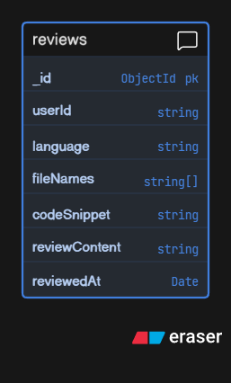
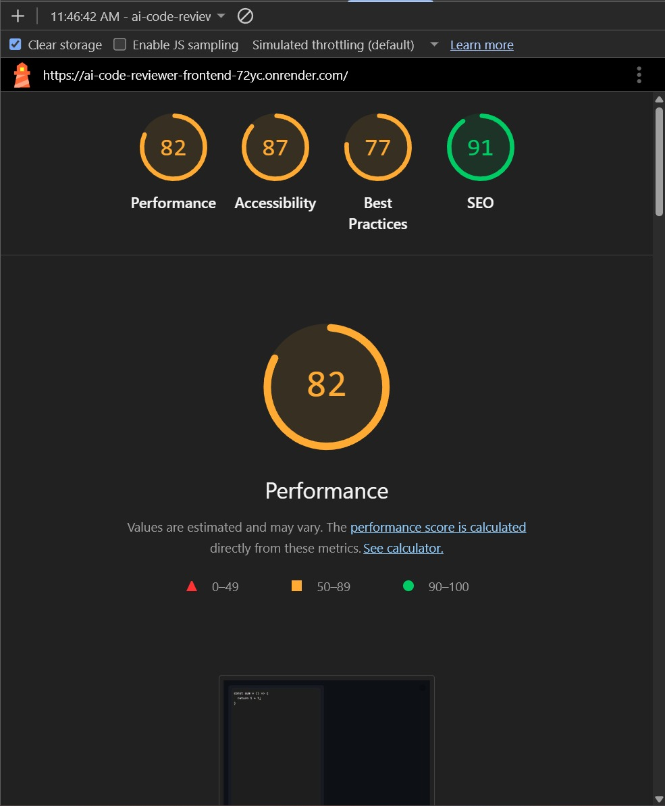

<h2 align="center">🚀 AI Code Reviewer</h2>


**Production-ready, AI-powered code review system with performance-optimized frontend, scalable backend, and intelligent caching.**

An end-to-end full-stack application that analyzes source code using **Large Language Models (LLMs)** to identify **bugs, anti-patterns, performance bottlenecks, and best-practice violations** — built with a strong emphasis on **real-world performance, scalability, and clean architecture**.

> ⚡ Achieved **~98 Lighthouse Performance score** on production
> ⚡ Reduced backend response latency by **~93% using Redis caching**

---

## 🔥 Key Highlights 

* **LLM-powered automated code review** using Google Gemini
* Identifies **syntax errors, anti-patterns, performance issues, and optimizations**
* **Redis-backed intelligent caching** → ~93% faster repeated API responses
* Secure REST APIs with **authentication & per-user rate limiting**
* **Performance-optimized React frontend** with near-zero blocking time
* Fully deployed with **CI/CD-driven production workflow**

---

## 🧠 System Architecture (High-Level)

* **Frontend (React + Tailwind)**
  Optimized rendering, asset loading, and Lighthouse performance

* **Backend (Node.js + Express)**
  Validated APIs, centralized error handling, authentication & rate limiting

* **Caching Layer (Redis)**
  Prevents redundant LLM calls and drastically reduces response time

* **AI Layer (Google Gemini API)**
  Handles contextual code analysis and structured review output

* **Deployment & CI/CD (Vercel + Render)**
  Automated builds, previews, and zero-downtime production deployments


-----
## 🛠 Tech Stack

### Frontend

* React.js
* Tailwind CSS

### Backend

* Node.js
* Express.js
* REST APIs
* Redis (Caching)

### AI

* Google Gemini API

### Deployment

* Frontend: Render
* Backend: Render

---

## 🔄 Database Schema 

The diagram below represents the **internal working flow** of the AI Code Reviewer — from user request to AI-powered analysis and optimized response delivery.


---
## ⚡ Frontend Performance Metrics

*Production deployment monitored using **Chrome DevTools & Lighthouse***

| Initial (Baseline)                                                                                                                         | After Optimization                                                                                                                           |
| ------------------------------------------------------------------------------------------------------------------------------------------ | -------------------------------------------------------------------------------------------------------------------------------------------- |
|  |
| **Score:** 82 <br/> **FCP:** ~1.5s <br/> **LCP:** ~2.0s <br/> **TBT:** ~0ms <br/> **Speed Index:** ~2.1s                                   | **Score:** ~98 <br/> **FCP:** ~0.6s <br/> **LCP:** ~1.0s <br/> **TBT:** 0ms <br/> **Speed Index:** ~0.9s                                     |

### Key Improvements

* Major reduction in **FCP** and **LCP**
* **Total Blocking Time reduced to 0 ms**
* Faster Speed Index via optimized rendering & asset loading
* No UX regressions during optimization

---

## ⚡ Backend Performance Optimization

* ~93% reduction in API response time using Redis caching (9.01s → 493ms)
* Initial uncached latency: 9.01s
* Cached response latency: 493ms
* **82.4% reduction in redundant Gemini API calls** via Redis cache hit detection
* **82.4% reduction in MongoDB queries** for repeated code submissions
* Verified across **14 live requests** — 14 cache hits, 3 misses (**82.4% cache hit rate**)

### 📊 Cache Performance Stats (Live Verification)

| Metric | Value |
|---|---|
| Total Requests | 17 |
| Cache Hits | 14 |
| Cache Misses | 3 |
| Cache Hit Rate | 82.4% |
| Gemini API Call Reduction | 82.4% |
| MongoDB Query Reduction | 82.4% |

### 📊 Cost Optimistaion and Database Loading Reduction Calculation Stats


### API Response — Without Cache


### API Response — With Redis Cache


---

## 📊 Frontend Performance Benchmarks (Averaged)

Measured using **Chrome Lighthouse** with simulated throttling.

* Tested across **5 independent runs**
* **Average Performance Score:** ~89
* **Avg FCP:** ~1.1s
* **Avg LCP:** ~1.6s
* **TBT:** 0 ms
* **CLS:** 0

> Metrics may vary slightly due to Lighthouse simulation.
> Remaining accessibility and bundle-size suggestions are tracked improvements.

---

## 🔁 CI/CD Pipeline (Render)


---

### ⚙️ Automated Deployment Flow (Render)

1. Code pushed to GitHub repository
2. Render automatically detects the new commit
3. Dependencies installed in isolated build environment
4. Application build executed (`npm install`, `npm run build`, etc.)
5. Health checks performed on the new deployment
6. Traffic seamlessly switched to the new version (zero downtime)

---

### ✅ Benefits

* 🚀 Zero-downtime deployments
* 🔄 Automatic deploy on every push
* 🧪 Isolated & consistent build environment
* 🔐 Secure environment variable management
* 🛠️ No manual CI/CD configuration needed

---

## ▶️ Run Locally

### Prerequisites

* Node.js (v18+)
* Redis (local or cloud)
* Google Gemini API key

### Clone

```bash
git clone https://github.com/swarnabha-dutta/AI_Code_Reviewer.git
cd AI_Code_Reviewer
```

### Backend

```bash
cd backend
npm install
npm run dev
```

`.env`

```env
PORT=5000
REDIS_URL=your_redis_url
GEMINI_API_KEY=your_api_key
```

### Frontend

```bash
cd frontend
npm install
npm run dev
```

---

## 🔗 Live Demo

👉 [https://ai-code-reviewer-frontend-72yc.onrender.com/](https://ai-code-reviewer-frontend-72yc.onrender.com/)

## 📂 Repository

👉 [https://github.com/swarnabha-dutta/AI_Code_Reviewer](https://github.com/swarnabha-dutta/AI_Code_Reviewer)

---

## 🧠 Key Learnings

* Prompt engineering for LLMs
* Redis-based backend caching
* Designing scalable AI-driven APIs
* Frontend performance optimization
* CI/CD-driven production deployment

---

## 👤 Author

**Swarnabha Dutta**
Full-Stack Developer | MERN | AI Systems


